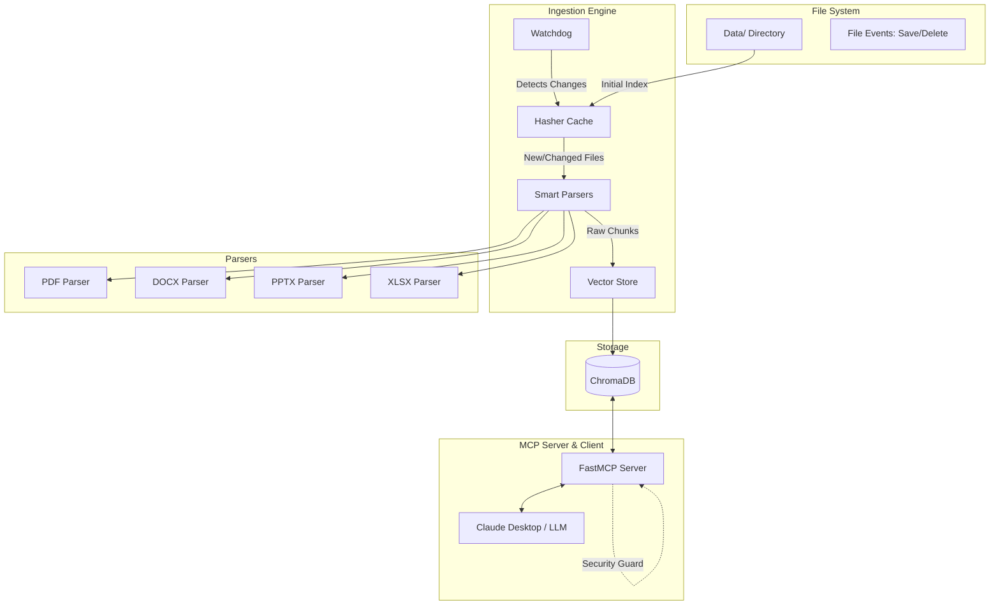

# generalStore — Made with ♥️  by Harshit

**generalStore** is a completely local Knowledge Engine that indexes all your messy study materials and connects them directly to Claude Desktop so you can chat with your own files, for free, with zero upload limits.

---

## 📖 The Origin Story (Why I Built This)

The only reason why I built `generalStore` is because this semester, my professors sent me almost **119 different files**—a chaotic mix of PDFs, PowerPoints, Word docs, and Excel sheets. I just scraped by this semester, and honestly, trying to manually read and organize all of them the night before an exam was both frustrating and incredibly boring.

I needed a way to instantly find answers hidden deep within gigabytes of local files without manually opening each one, and without paying for expensive cloud storage or hitting upload limits on AI chatbots. Thus, `generalStore` was born.

---

## ⚙️ How It Works (High-Level Overview)

The system begins by scanning and processing all of your local documents. Using a local AI embedding model (`sentence-transformers`), it transforms the extracted text into numerical representations (embeddings), which are then stored securely in a local **ChromaDB vector database**. 

When you ask a question, Claude communicates with our custom **MCP (Model Context Protocol) server**. The server performs a semantic search across your local database, retrieves the most relevant information from your notes, and provides it to Claude as precise context for generating an accurate, cited answer.

---

## 🌟 Core Features

- **Local Vector Database**: Powered by **ChromaDB** and `sentence-transformers` (`all-MiniLM-L6-v2`), keeping all your data local and secure.
- **Smart Parsers**: Dedicated, semantic parsers for `.pdf`, `.docx`, `.pptx`, and `.xlsx` files that retain document structure (headings, slides, tables).
- **Asynchronous Ingestion**: Built with `asyncio`, utilizing thread pools and queues to process hundreds of files quickly without blocking.
- **File System Watchdog**: A background daemon that monitors your data directories, automatically indexing new files or surgically deleting removed files.
- **Intelligent Caching**: Uses SHA-256 content hashing to ensure files are only re-indexed if their content actually changes.
- **FastMCP Server**: Exposes your local knowledge base to LLMs using the official Model Context Protocol (v3).
- **Beautiful CLI**: A terminal interface built with Click and Rich for stunning progress bars and formatted outputs.
- **Security Guard**: Strict path-traversal protection ensures the engine can only read from explicitly allowed directories.

---

## ⚠️ Limitations

- **Scanned PDFs without Text/OCR**: The PDF parser relies on extractable text blocks. It does not perform OCR on scanned images. You need searchable PDFs for text extraction.
- **Large Video/Audio Files**: This engine is designed for text-based study materials and does not transcribe or parse media files.
- **LLM Context Limits**: When querying via Claude Desktop, the amount of data returned is limited by the context window, so semantic search retrieves only the most relevant chunks.
- **Memory Consumption**: Processing massive directories concurrently might temporarily spike memory usage due to vector embedding generation.

---

## 🎯 Use Cases

- **Students & Researchers**: Instantly query hundreds of research papers, lecture slides, and typed notes.
- **Developers**: Index project documentation, specifications, and architecture PDFs to ask Claude coding questions with precise context.
- **Writers & Creators**: Organize large manuscript drafts, lore bibles, or character sheets in word documents and search through them instantly.
- **Local Privacy Advocates**: Have a "chat with your data" experience without uploading your sensitive personal documents to third-party cloud services.

---

## 📂 Detailed Folder Structure for Study Materials

You can organize your study materials (PDFs, PPTs, etc.) inside your `Data` directory using standard folders. The `generalStore` engine recursively scans subdirectories, allowing you to categorize your files effectively. 

### Example: Organizing by Subjects
If you are a student taking multiple subjects, you can structure your `Data` directory as follows:

```text
Data/
├── Mathematics/
│   ├── Calculus_Notes.pdf
│   ├── Linear_Algebra_Slides.pptx
│   └── Assignments/
│       ├── Assignment_1.pdf
│       └── Assignment_2.docx
├── C/
│   ├── C_Programming_Language_Book.pdf
│   └── Lab_Manuals/
│       └── Lab_1_to_5.pdf
└── Java/
    ├── Core_Java_Concepts.pdf
    ├── SpringBoot_Cheatsheet.xlsx
    └── Projects/
        └── ECommerce_Architecture.docx
```

**How it works**:
- **Categorization**: By creating subfolders like `Mathematics`, `C`, and `Java`, you keep your files visually organized.
- **Recursive Indexing**: When you run `generalstore index`, the engine crawls the entire `Data` directory, including all nested subfolders (e.g., `Data/Mathematics/Assignments/`).
- **Path Context**: The file path is stored as metadata in the vector database. This means when you search, the engine knows *where* the data came from. Claude can then use this path to understand that a chunk of text is specifically from your "Java" folder.

---

## 🛠️ Project Architecture

The system is built on a modular, multi-phase architecture:



### Components
1. **Foundation & Configuration (`config.py`)**: Uses `pydantic-settings` to load configuration from a `.env` file (manages `WATCHED_DIRS`, `CHROMA_DB_PATH`, `EMBEDDING_MODEL`).
2. **Semantic Parsers (`parsers/`)**: Extracts text into standardized `DocumentChunk` objects while retaining metadata (headings, tables, slides).
3. **Vector Store (`vectorstore/store.py`)**: Interfaces with ChromaDB for idempotent batched upserts.
4. **Ingestion Engine & Watchdog (`ingestion/`)**: Manages state, hashes files to prevent duplicate work, and monitors the file system for live updates using `watchdog`.
5. **FastMCP Server (`server/mcp_server.py`)**: Exposes read-only tools (`query_knowledge`, `list_indexed_files`, `get_index_stats`) to LLMs via the Model Context Protocol.
6. **Security Guard (`security/guard.py`)**: Prevents path traversal attacks and ensures the engine only accesses explicitly allowed directories.

---

## 🚀 Installation & Setup

### Prerequisites
- Python 3.10+
- macOS/Linux/Windows

### 1. Clone & Environment Setup
```bash
git clone https://github.com/Itsharshitgoat/generalStore.git
cd generalStore
python3 -m venv venv
source venv/bin/activate
```

### 2. Configuration
Create a `.env` file in the root directory:
```env
# Point this to your main Data folder where you store your PDFs and notes
WATCHED_DIRS=/path/to/your/Data
CHROMA_DB_PATH=/path/to/your/chroma_db
EMBEDDING_MODEL=all-MiniLM-L6-v2
```

### 3. Install the Package
```bash
pip install -e "."
```

### 4. (Optional) Set up an Alias
Add this to your `~/.zshrc` or `~/.bashrc` to run it globally:
```bash
alias generalstore="/path/to/generalStore/venv/bin/generalstore"
```

---

## 💻 How to Use (CLI Commands)

The CLI provides easy commands to manage your local knowledge base.

- **Index your files**: Performs a bulk ingestion of your `Data/` directory. Reads the hash cache to skip unchanged files.
  ```bash
  generalstore index
  ```
- **Search manually**: Perform a semantic search from your terminal. Returns top matching chunks with citations.
  ```bash
  generalstore search "Dijkstra algorithm"
  ```
- **Watch for changes**: Starts the background daemon to actively monitor your folders for new or changed files.
  ```bash
  generalstore watch
  ```
- **Check status**: Shows detailed statistics about your indexed chunks and files.
  ```bash
  generalstore status
  ```
- **Purge database**: Clears the entire vector store to start fresh.
  ```bash
  generalstore purge
  ```
- **Start MCP Server**: Starts the server using STDIO transport for Claude to connect to.
  ```bash
  generalstore serve
  ```

---

## 🤖 How to Install on Claude Desktop

You can give Claude Desktop direct access to your local knowledge base by configuring it to use `generalStore` as an MCP server.

1. **Locate Claude Desktop Config**:
   - macOS: `~/Library/Application Support/Claude/claude_desktop_config.json`
   - Windows: `%APPDATA%\Claude\claude_desktop_config.json`
2. **Edit the Config File**: Add the following JSON structure to register the server. Ensure the paths are absolute and point to your virtual environment's executable.

```json
{
  "mcpServers": {
    "generalStore": {
      "command": "/absolute/path/to/generalStore/venv/bin/generalstore",
      "args": ["serve"]
    }
  }
}
```
*(Example: `/Users/xlr-01/Desktop/DTU/generalStore/venv/bin/generalstore`)*

3. **Restart Claude Desktop**.
4. **Test the Integration**: You can now ask Claude: 
   - *"Use the generalStore search_knowledge tool to find my notes on Mathematics."*
   - *"List the indexed files in my Java folder."*

---

*Built out of necessity, designed for simplicity. Feed it your messy notes; it returns structured, searchable knowledge.*
