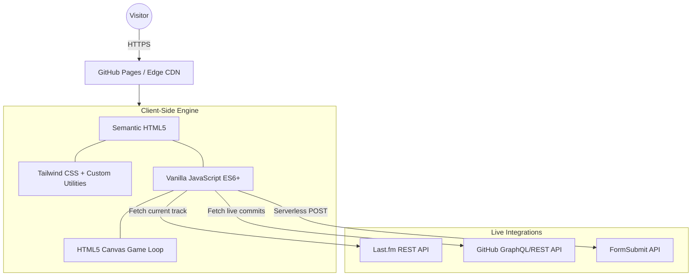

<div align="center">

# 🚀 Harshit's Digital Universe
### *The Ultimate AI & OS Developer Portfolio Experience*

*“Code is poetry, but performance is the rhythm. Design is the soul, but logic is the mind.”*

[](https://itsharshitgoat.github.io/Website/)
[](https://github.com/itsharshitgoat/Website)
[](#-license)
[](https://developer.mozilla.org/en-US/docs/Web/JavaScript)
[](https://tailwindcss.com/)

</div>

---

## 📖 Executive Overview

Welcome to the comprehensive technical documentation for my digital portfolio. This is not a standard static website; it is a **living, breathing, interactive digital ecosystem** meticulously engineered to showcase my philosophy, design aesthetics, and hardcore development skills.

Designed with a strict **"Performance-First & Zero-Build"** philosophy, this application actively avoids the bloated ecosystems of modern JavaScript frameworks like React, Vue, or Angular. Instead, it relies on the raw power of **Vanilla JavaScript (ES6+)**, deeply integrated **Tailwind CSS**, and the **HTML5 Canvas API** to deliver a beautifully fluid, hardware-accelerated user experience. 

It is an experimental playground where web standards are pushed to their absolute limits to create magic without the overhead.

---

## 📑 Table of Contents
1. [✨ Core Interactive Features](#-core-interactive-features)
2. [🏗️ System Architecture & Stack](#-system-architecture--stack)
3. [🌌 The Dual Realms: Heaven & Hell](#-the-dual-realms-heaven--hell)
4. [🎮 Hidden Easter Eggs & Mini-Games](#-hidden-easter-eggs--mini-games)
5. [🌊 Deep Dive: Component Breakdown](#-deep-dive-component-breakdown)
6. [⚡ Performance & Design Philosophy](#-performance--design-philosophy)
7. [🔮 Future Roadmap](#-future-roadmap)
8. [💻 Local Setup & Deployment](#-local-setup--deployment)
9. [📜 License & Credits](#-license--credits)

---

## ✨ Core Interactive Features

- **The Dual Realms (Heaven & Hell):** Dynamic, atmospheric state changes. Scroll into "Heaven" to explore my favorite books within an ethereal, dusty, 3D card layout. Trigger the "Hell Layer" to descend into a fiery underworld representing the ultimate "sins of bad code" complete with glowing embers and CSS-driven smoke.
- **Interactive Social Media Pill Game:** The footer isn't just a static link hub. It houses an attention-based mechanic that transforms the UI into a fully playable, physics-driven Canvas mini-game.
- **Liquid Glass Music Pill (Last.fm):** A dynamic, floating widget that tracks my live Last.fm listening history. It features real-time CSS equalizer animations and smart cache-busting fetching.
- **Global AI Chatbot Assistant:** An ever-present, glowing chatbot bubble leveraging a 200% gradient pan (`#0047AB` to `#9B41DB` to `#FFD700`). It features a unique blinking animated face and handles conversational intent smoothly.
- **Command Palette (Terminal):** Pressing `⌘ + K` triggers an interactive, styled web terminal that acts as a power-user navigation tool.
- **Live GitHub Contribution Graph:** Seamless integration with the GitHub API to render my live commit history and contribution streak directly into the UI's glassmorphic cards.
- **Magnetic Navigation Blob:** A smart navigation shell where a frosted-glass element mathematically interpolates to track your cursor's hover state across all anchor links.

---

## 🏗️ System Architecture & Stack

By eliminating the Virtual DOM, this project achieves a Time to Interactive (TTI) and First Contentful Paint (FCP) that rivals statically generated sites, while maintaining the interactivity of an SPA.



### The Tech Stack
* **DOM Manipulation:** 100% Vanilla JavaScript. No jQuery, no React. Native DOM APIs `querySelector`, `classList`, and `IntersectionObserver` drive the interactions.
* **Styling Engine:** Tailwind CSS via CDN. I use custom inline configuration to inject advanced styling parameters (e.g., specific `box-shadow` inset glows, custom fonts).
* **Animations:** A hybrid approach using GSAP (GreenSock) for complex, orchestrated scroll sequences, and native CSS `transform` / `opacity` transitions for micro-interactions to leverage GPU hardware acceleration.

---

## 🌌 The Dual Realms: Heaven & Hell

One of the most ambitious features of the site is its thematic state transitions, creating entirely new worlds within the DOM.

### 🕊️ The Heaven Layer
- **Aesthetic:** Clean, white, highly blurred frosted glass.
- **Content:** Represents a quiet library. It houses 3D-rendered book cards (e.g., *Snow Crash*, *Ready Player One*, *The Art of Game Design*).
- **Physics:** Uses custom ambient dust particles (`.dust-particle`) that drift infinitely across the screen.

### 🔥 The Hell Layer
- **Aesthetic:** Dark, intense, featuring deep reds, oranges, and absolute blacks.
- **Content:** The "Infernal Realm". It showcases the "Sins of Code" (e.g., *The Untouchable Function*, *Friday Deployment*, *Works on my Machine*) as violently floating cards.
- **Physics:** Employs `.hell-ember` spans that calculate randomized drift variables (`--ember-drift`, `--ember-dur`) to create a hauntingly accurate fire-particle simulation.

---

## 🎮 Hidden Easter Eggs & Mini-Games

I strongly believe a portfolio should reward curious users.

1. **The Social Pill Game:** If a user hovers or interacts with the social media pill for a continuous duration, a hidden HTML5 Canvas game engine initiates. Complete with circle-to-point collision physics, particle lifecycles (explosions/thrusters), and screen-shake feedback.
2. **The `⌘ + K` Terminal:** A power-user feature prominently hinted at in the Hero section via a glowing keyboard pulse. Activating this brings up a functional command-line interface within the browser.

---

## 🌊 Deep Dive: Component Breakdown

### 1. The Hero Section
- **Typewriter Loop:** A meticulously crafted string-manipulation function that types out personal philosophies, handles pauses, backspaces, and controls a custom blinking CSS cursor.
- **Staggered Waterfall Entrance:** Every element (titles, descriptions, buttons) is bound to an `IntersectionObserver` that injects them into the view using sequentially delayed CSS transforms.

### 2. Bento Grid Projects
- Utilizes an asymmetrical, highly modern layout system (`display: grid`) that automatically adjusts column spans based on viewport breakpoints. 
- Integrated with a custom **Modal Engine** that intercepts clicks, freezes body scrolling (`overflow: hidden`), and pops out the project details with a heavy background blur.

### 3. About & Horizontal Journey
- **Horizontal Scrolling Engine:** Instead of vertical scrolling, this section uses `scroll-snap-type: x mandatory` to create a paged, horizontal timeline. It calculates precise `scrollLeft` offsets for programmatic button navigation.

### 4. Dynamic Music Pill
- **Polling System:** Pings the `user.getrecenttracks` Last.fm endpoint every 15 seconds.
- **UI Swaps:** If music is playing, an intricate 4-bar CSS equalizer (`.eq-bar`) dances to the rhythm. If paused, it gracefully degrades to a "Last Listened" timestamp.

---

## ⚡ Performance & Design Philosophy

1. **Micro-Interactions are King:** From the soft lift of "Squircle" UI buttons to the deep drop-shadow of the Heaven book cards, every hover state provides tactile, visual feedback.
2. **Hardware Acceleration:** Animations are strictly limited to `transform` and `opacity` properties. This ensures the browser offloads the work to the GPU, preventing layout thrashing and maintaining a stable 60 FPS.
3. **Typography Strategy:** 
   - *Helvetica Neue*: For high-impact, bold headers.
   - *Inter*: For buttery-smooth, legible body text.
   - *Roboto Mono*: Exclusively for terminal commands, code snippets, and structural data.
4. **Mobile First:** The application naturally degrades into single-column layouts. Touch targets are expanded (`min-height: 44px`), and `hover` states are smartly disabled or replaced with `active` tap-states on mobile devices.

---

## 🔮 Future Roadmap

The ecosystem is always evolving. Here is the active pipeline:

- [ ] **WebGL Background:** Porting the static Hero background into an interactive `Three.js` particle mesh.
- [ ] **Dark Mode V2 (OLED):** True absolute blacks `#000000` combined with neon-accent lines for OLED displays.
- [ ] **Headless CMS Integration:** Decoupling the project definitions into a CMS (Contentful / Sanity) so I don't have to push code to update my portfolio.
- [ ] **Firebase Leaderboard:** Hooking up the hidden Social Pill game to a serverless real-time database to track global high scores.
- [ ] **LLM Brain for Chatbot:** Upgrading the Chatbot from deterministic logic paths to an integration with OpenAI/Gemini to provide fully autonomous responses.

---

## 💻 Local Setup & Deployment

The beauty of a zero-build pipeline is the frictionless developer experience. 

1. **Clone the Source:**
   ```bash
   git clone https://github.com/itsharshitgoat/Website.git
   ```
2. **Navigate:**
   ```bash
   cd Website
   ```
3. **Run Locally:**
   Because there is no Webpack, Vite, or Babel, you can literally just open the file:
   - Double click `index.html`
   - Or, for a better experience, spin up a local server:
     ```bash
     npx serve .
     # OR
     python -m http.server 8000
     ```

**Deployment** is handled automatically by pushing to the `main` branch, served instantly via GitHub Pages.

---

## 📜 License & Credits

This project is open-sourced under the **[MIT License](LICENSE)**. 

I built this to inspire and be inspired. If you find my structural approach, the dual-realm thematic switching, or the vanilla JS physics engine useful, feel free to fork it. However, I kindly request that you credit the original design and architecture back to me.

<div align="center">
  <br/>
  <b>Engineered & Designed with ☕ and ❤️ by Harshit</b>
  <br/>
  <i>"What if we made it do this… but cooler?"</i>
</div>